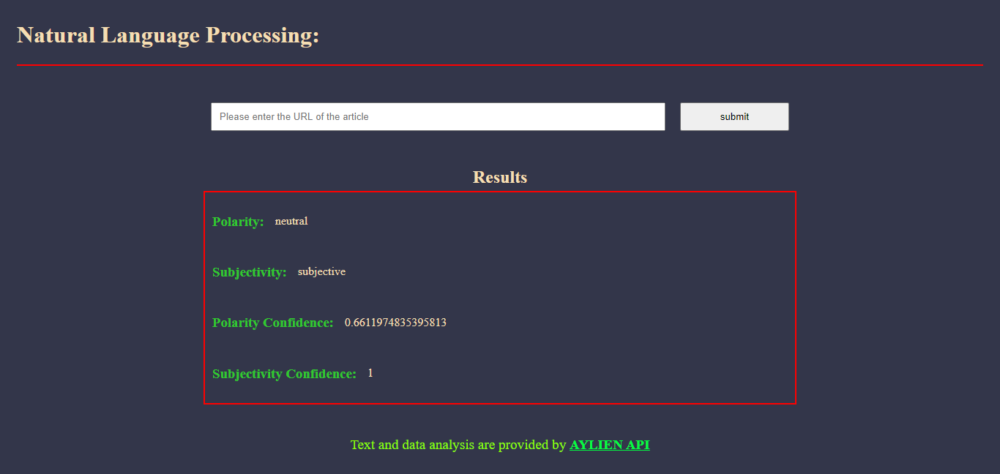

# Sentiment Analysis Website

## Project 4 - News Article NLP (Front End Developer Udacity Nanodegree)

### Created with HTML, CSS, Javascript (Vanilla), Node.js, and webpack

### Project Objective

Building a News Article/ Blog Sentiment Analysis website using Natural Language Processing (NLP) API. The website allows user to type in any url containing an article or a blog, and with the help of Aylien API analyse the sentiment of it through getting insight about the author's emotions and perspective.

## Project Goals

The goal of this project is to practice with:
- Setting up Webpack
- Webpack Loaders and Plugins
- Service workers
- Using APIs and creating requests to external urls

## Getting started

### Install packages and dependecies to produce the node_modules folder
	$npm install

### Install the webpack dev server globally
	npm install -g webpack-dev-server

### Add a .env file and fill the .env file with your API keys:
	API_ID=**************************
	API_KEY=**************************

### Install node.js on your machine and then start server at port number: 8000
    $npm start

### Run the app in the dev mode
	$ npm run build-dev
	$ npm run start
	Note:: The web page can be accessed with localhost:7000

### Run the app in the prod mode
	$ npm run build-prod
	$ npm run start
	Note:: The web page can be accessed with localhost:8000

## Configs
The project contains a package.json file two webpack config files webpack.config.dev.js and webpack.config.prod.js for development and production respectfully. When the development mode is run, it starts the webpack dev server at port 8000

## Offline Functionality
The project have service workers set up in webpack.

## Testing

### Fire test with Jest and watch tests
    npm test

## Result

